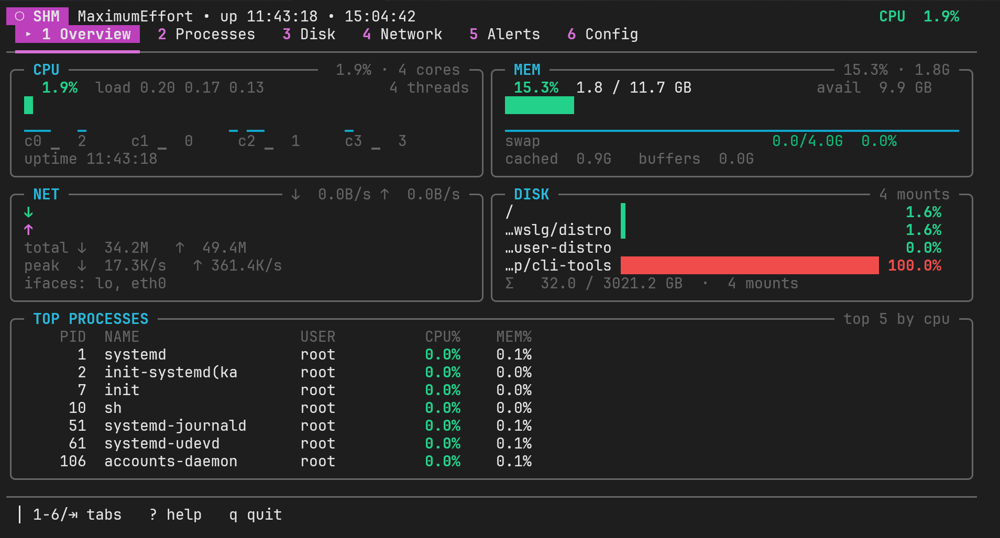

# 🖥️ Server Health Monitor (SHM)

A lightweight, production-ready system health monitor for **Linux, macOS, and Windows**. Beautiful terminal UI and email alerts — all from a single `pipx install`.

[](https://pypi.org/project/server-health-monitor/)
[](https://pypi.org/project/server-health-monitor/)
[](LICENSE)



---

## ✨ Features

- **Cross-platform** — Runs on Linux, macOS, and Windows (uses OS-native config/log paths on each)
- **Interactive TUI** — Full-screen terminal dashboard (like `htop`, but for everything)
- **Email Alerts** — Get notified when CPU, memory, disk, or swap cross thresholds
- **Auto-start on Boot** — One command to install as a systemd service (Linux)
- **Zero Config** — Works out of the box; a default config is auto-created on first run
- **Lightweight** — Only `psutil`, `PyYAML`, `loguru`, and `pydantic` as core dependencies

---

## 📦 Installation

The **recommended** way to install `monitor` is with [`pipx`](https://pipx.pypa.io/) — it creates an isolated virtualenv behind the scenes and exposes the `monitor` command globally, sidestepping PEP 668's `externally-managed-environment` errors on modern distros.

```bash
pipx install server-health-monitor
pipx ensurepath        # adds ~/.local/bin to PATH (open a new shell after)
```

### Install `pipx` for your distro

<details>
<summary><strong>Debian / Ubuntu / Linux Mint / Pop!_OS</strong></summary>

```bash
sudo apt update
sudo apt install -y pipx
pipx ensurepath
```
</details>

<details>
<summary><strong>Kali Linux</strong></summary>

```bash
sudo apt update
sudo apt install -y pipx
pipx ensurepath
```
</details>

<details>
<summary><strong>Fedora</strong></summary>

```bash
sudo dnf install -y pipx
pipx ensurepath
```
</details>

<details>
<summary><strong>RHEL / CentOS Stream / Rocky / AlmaLinux (9+)</strong></summary>

```bash
sudo dnf install -y python3-pip
python3 -m pip install --user pipx
python3 -m pipx ensurepath
```
</details>

<details>
<summary><strong>Arch Linux / Manjaro / EndeavourOS</strong></summary>

```bash
sudo pacman -S --needed python-pipx
pipx ensurepath
```
</details>

<details>
<summary><strong>openSUSE (Tumbleweed / Leap)</strong></summary>

```bash
sudo zypper install -y python3-pipx
pipx ensurepath
```
</details>

<details>
<summary><strong>Alpine Linux</strong></summary>

```bash
sudo apk add pipx
pipx ensurepath
```
</details>

<details>
<summary><strong>Void Linux</strong></summary>

```bash
sudo xbps-install -S python3-pipx
pipx ensurepath
```
</details>

<details>
<summary><strong>Gentoo</strong></summary>

```bash
sudo emerge --ask dev-python/pipx
pipx ensurepath
```
</details>

<details>
<summary><strong>NixOS</strong></summary>

```bash
nix-env -iA nixpkgs.pipx
pipx ensurepath
```
Or declaratively via `environment.systemPackages = [ pkgs.pipx ];`.
</details>

<details>
<summary><strong>macOS</strong></summary>

```bash
# with Homebrew (recommended)
brew install pipx
pipx ensurepath

# or via the system python3
python3 -m pip install --user pipx
python3 -m pipx ensurepath
```
Open a new terminal so the updated PATH is picked up, then `pipx install server-health-monitor`.
</details>

<details>
<summary><strong>Windows (PowerShell)</strong></summary>

Install Python 3.9+ from [python.org](https://www.python.org/downloads/windows/) (tick "Add python.exe to PATH" in the installer), then:

```powershell
python -m pip install --user pipx
python -m pipx ensurepath
# close and reopen PowerShell, then:
pipx install server-health-monitor
monitor
```

Alternatively, via [Scoop](https://scoop.sh/) or [winget](https://learn.microsoft.com/windows/package-manager/winget/):

```powershell
# Scoop
scoop install pipx ; pipx ensurepath

# winget
winget install --id pypa.pipx ; pipx ensurepath
```

> The Windows TUI uses [`windows-curses`](https://pypi.org/project/windows-curses/), which is installed automatically. Works best in **Windows Terminal** or **PowerShell 7+** — legacy `conhost.exe` may render some Unicode glyphs as tofu.
</details>

<details>
<summary><strong>Any OS (fallback — install pipx via pip)</strong></summary>

If your OS doesn't ship `pipx`:

```bash
python3 -m pip install --user pipx
python3 -m pipx ensurepath
```
</details>

Then install SHM:

```bash
pipx install server-health-monitor
```

### Alternative: virtualenv + `pip`

If you'd rather not use `pipx`:

```bash
python3 -m venv ~/.venvs/shm
source ~/.venvs/shm/bin/activate
pip install server-health-monitor
monitor
```

> **⚠️ Do not** run `pip install server-health-monitor` system-wide on modern Linux — it will fail with `error: externally-managed-environment` (PEP 668), or pollute your OS Python if forced with `--break-system-packages`.

### Upgrading

```bash
pipx upgrade server-health-monitor
```

### Uninstalling

```bash
pipx uninstall server-health-monitor
```

### Platform Support

| Feature                       | Linux | macOS | Windows |
| ----------------------------- | :---: | :---: | :-----: |
| TUI dashboard                 |   ✅   |   ✅   |    ✅    |
| Background daemon (`--daemon`)|   ✅   |   ✅   |    ✅    |
| Email alerts                  |   ✅   |   ✅   |    ✅    |
| Metrics / log files           |   ✅   |   ✅   |    ✅    |
| Boot service (`--install`)    |   ✅   |   —   |    —    |
| Load averages                 |   ✅   |   ✅   |   n/a¹  |

¹ Windows has no load-average concept; the field is reported as `0.00`.

On **macOS** and **Windows**, use your OS-native scheduler (launchd / Task Scheduler) to run `monitor --daemon` at login if you want it on boot. `--install` only wires up a systemd service on Linux.

**Default paths per OS:**

| | Config | Log |
|---|---|---|
| Linux (user)   | `~/.config/shm/config.yaml`                | `~/.local/state/shm/monitor.log`        |
| Linux (root)   | `/etc/shm/config.yaml`                     | `/var/log/shm/monitor.log`              |
| macOS          | `~/Library/Application Support/shm/config.yaml` | `~/Library/Logs/shm/monitor.log`   |
| Windows        | `%APPDATA%\SHM\config.yaml`                | `%LOCALAPPDATA%\SHM\monitor.log`        |

Override the log path anywhere with the `SHM_LOG_FILE` environment variable.

---

## 🚀 Quick Start

### 1. Launch the TUI

```bash
monitor
```

Navigate with `1`–`6` or `Tab` to switch between views: **Overview**, **Processes**, **Disk**, **Network**, **Alerts**, and **Config**.

### 2. Run as Background Daemon

```bash
monitor --daemon
```

Collects metrics, checks thresholds, and sends email alerts — no UI.

---

## 🔧 Configuration

SHM reads from `config.yaml` in the current directory (or pass `--config /path/to/config.yaml`).

### Default Config

```yaml
thresholds:
  cpu_percent: 85.0
  memory_percent: 85.0
  disk_percent: 90.0
  swap_percent: 80.0

alerts:
  enabled: true
  cooldown_minutes: 5
  log_file: alerts.jsonl

smtp:
  enabled: false
  host: smtp.gmail.com
  port: 587
  username: ""
  password: ""
  from_addr: admin@example.com
  to_addrs:
    - alerts@example.com
  use_tls: true

collection_interval: 5
metrics_log: metrics.jsonl
```

You can also edit the config directly in the TUI — press `6` to go to the **Config** tab, use arrow keys to navigate, `Enter` to edit, and `s` to save.

---

## 📧 Email Alerts Setup

### Gmail (Recommended)

1. **Create a Google App Password**  
   Go to [https://myaccount.google.com/apppasswords](https://myaccount.google.com/apppasswords) and generate a 16-character app password.

2. **Update your config**:
   ```yaml
   smtp:
     enabled: true
     host: smtp.gmail.com
     port: 587
     username: "you@gmail.com"
     password: "abcd efgh ijkl mnop"    # your app password
     from_addr: "you@gmail.com"
     to_addrs:
       - "alerts@yourcompany.com"
     use_tls: true
   ```

3. **Test it** — Set `cpu_percent: 1.0` temporarily and run:
   ```bash
   monitor --daemon
   ```
   You should receive an email within seconds.

> **Important:** The TUI (`monitor`) is display-only. Email alerts are sent by the **daemon** (`monitor --daemon`) or the OS-level service you configure below.

### Other SMTP providers

The same `smtp:` block works for any SMTP server — just change `host`, `port`, `username`, `password`, and `use_tls`. Common examples:

| Provider           | host                      | port | use_tls | notes                                                |
| ------------------ | ------------------------- | ---- | :-----: | ---------------------------------------------------- |
| Gmail              | `smtp.gmail.com`          | 587  | true    | Requires [App Password](https://myaccount.google.com/apppasswords) |
| Outlook / Hotmail  | `smtp-mail.outlook.com`   | 587  | true    | Requires App Password if 2FA is on                   |
| Office 365         | `smtp.office365.com`      | 587  | true    | Must be allowed by tenant admin                      |
| iCloud             | `smtp.mail.me.com`        | 587  | true    | Use an app-specific password                         |
| SendGrid           | `smtp.sendgrid.net`       | 587  | true    | username = `apikey`, password = API key              |
| Mailgun            | `smtp.mailgun.org`        | 587  | true    | SMTP credentials from the Mailgun dashboard          |
| AWS SES            | `email-smtp.<region>.amazonaws.com` | 587 | true | SMTP credentials (not IAM)                       |

---

## 🔄 Auto-Start on Boot

Run `monitor --daemon` at login/boot so alerts fire 24/7, even with no user logged in.

### Linux (systemd)

One-line install — bundles a systemd unit, enables it, and starts it:

```bash
sudo monitor --install
```

This will:
- Copy a default config to `/etc/shm/config.yaml`
- Register and enable a `shm` systemd service
- Start the daemon immediately

After installation:

```bash
# Edit config (SMTP credentials, thresholds, etc.)
sudo nano /etc/shm/config.yaml

# Apply changes
sudo systemctl restart shm
```

Management commands:

| Command | Description |
|---|---|
| `sudo systemctl status shm`  | Check if daemon is running |
| `sudo systemctl restart shm` | Restart after config changes |
| `sudo journalctl -u shm -f`  | Watch live logs |
| `sudo monitor --uninstall`   | Remove the service |

### macOS (launchd)

`--install` is Linux-only. To run `monitor --daemon` automatically at login, create a LaunchAgent:

1. **Find the full path to `monitor`:**
   ```bash
   which monitor
   # e.g. /Users/you/.local/bin/monitor
   ```

2. **Create `~/Library/LaunchAgents/com.shm.monitor.plist`:**
   ```xml
   <?xml version="1.0" encoding="UTF-8"?>
   <!DOCTYPE plist PUBLIC "-//Apple//DTD PLIST 1.0//EN"
     "http://www.apple.com/DTDs/PropertyList-1.0.dtd">
   <plist version="1.0">
   <dict>
     <key>Label</key>              <string>com.shm.monitor</string>
     <key>ProgramArguments</key>
     <array>
       <string>/Users/you/.local/bin/monitor</string>
       <string>--daemon</string>
     </array>
     <key>RunAtLoad</key>          <true/>
     <key>KeepAlive</key>          <true/>
     <key>StandardOutPath</key>    <string>/tmp/shm.out.log</string>
     <key>StandardErrorPath</key>  <string>/tmp/shm.err.log</string>
   </dict>
   </plist>
   ```
   Replace `/Users/you/.local/bin/monitor` with the path from step 1.

3. **Load it:**
   ```bash
   launchctl load  ~/Library/LaunchAgents/com.shm.monitor.plist   # start
   launchctl unload ~/Library/LaunchAgents/com.shm.monitor.plist  # stop
   launchctl list | grep shm                                      # status
   ```

Config lives at `~/Library/Application Support/shm/config.yaml`. Logs: `~/Library/Logs/shm/monitor.log`.

### Windows (Task Scheduler)

`--install` is Linux-only. On Windows, register a scheduled task that runs `monitor --daemon` at login:

**Option A — PowerShell (one-liner, per-user at login):**

```powershell
# Find the full path
$monitor = (Get-Command monitor).Source

# Register a task that runs at logon and restarts on failure
$action   = New-ScheduledTaskAction    -Execute $monitor -Argument '--daemon'
$trigger  = New-ScheduledTaskTrigger   -AtLogOn
$settings = New-ScheduledTaskSettingsSet -StartWhenAvailable -RestartCount 3 -RestartInterval (New-TimeSpan -Minutes 1)
Register-ScheduledTask -TaskName 'SHM Monitor' -Action $action -Trigger $trigger -Settings $settings

# Start it now
Start-ScheduledTask -TaskName 'SHM Monitor'

# Check status / stop / remove
Get-ScheduledTask    -TaskName 'SHM Monitor'
Stop-ScheduledTask   -TaskName 'SHM Monitor'
Unregister-ScheduledTask -TaskName 'SHM Monitor' -Confirm:$false
```

**Option B — Task Scheduler GUI:**

1. Open **Task Scheduler** → *Create Task*.
2. **General** tab: name `SHM Monitor`, tick *Run whether user is logged on or not*.
3. **Triggers**: *New* → *At log on* (or *At startup*).
4. **Actions**: *New* → *Start a program* → browse to `monitor.exe` (path from `where.exe monitor`) → arguments `--daemon`.
5. **Settings**: tick *If the task fails, restart every 1 minute, up to 3 times*.

Config lives at `%APPDATA%\SHM\config.yaml`. Logs: `%LOCALAPPDATA%\SHM\monitor.log`.

> **Note:** On all platforms, the interactive TUI (`monitor`) runs independently of the daemon. You can keep the daemon alerting in the background and launch the TUI any time for a live view.

---

## 🎮 TUI Keyboard Reference

### Global
| Key | Action |
|---|---|
| `1`–`6` / `Tab` | Switch view |
| `Shift+Tab` | Previous view |
| `?` | Show help overlay |
| `q` | Quit |

### Processes View
| Key | Action |
|---|---|
| `↑` `↓` | Select process |
| `/` | Search by name or PID |
| `s` | Cycle sort (CPU → MEM → PID → Name) |
| `k` | Kill selected process (with confirmation) |
| `Esc` | Clear search |

### Config View
| Key | Action |
|---|---|
| `↑` `↓` | Navigate fields |
| `Enter` | Edit field value |
| `s` | Save config to disk |

---

## 📊 What Gets Monitored?

| Category | Metrics |
|---|---|
| **CPU** | Total %, per-core %, load average, temperature (if available) |
| **Memory** | Used/total, percentage, available, cached, buffers, swap |
| **Disk** | All mounted partitions — used/total/free per mount |
| **Network** | RX/TX rates, total bytes, per-interface stats, errors/drops |
| **Processes** | PID, name, user, CPU%, MEM%, status — sortable and searchable |

---

## 📁 File Structure

After running, SHM creates these files in the working directory:

| File | Purpose |
|---|---|
| `config.yaml` | Configuration (thresholds, SMTP, intervals) |
| `metrics.jsonl` | Timestamped metric snapshots (auto-rotated at 10k lines) |
| `alerts.jsonl` | Alert history log |
| `monitor.log` | Application log (rotated at 10 MB) |

---

## 🔍 Troubleshooting

### `monitor: command not found`
If you installed with `pipx`, run `pipx ensurepath` and open a new shell.
If you installed in a venv, activate it first: `source path/to/venv/bin/activate`.

### `error: externally-managed-environment`
This is PEP 668 on Kali / Debian / Ubuntu — `pip install` outside a venv is blocked by the OS. Use `pipx install server-health-monitor` (recommended), or install inside a venv. See the [Installation](#-installation) section.

### Not receiving emails
- Ensure the **daemon** is actually running — the TUI alone does not send emails.
  - **Linux**: `sudo systemctl status shm` (if installed as a service) or run `monitor --daemon` in a shell.
  - **macOS**: `launchctl list | grep shm`
  - **Windows**: `Get-ScheduledTask -TaskName 'SHM Monitor'`
- Verify `smtp.enabled: true` and `alerts.enabled: true` in your config.
- For Gmail/Outlook/iCloud: use an **app-specific password**, not your login password.
- Check the log file:
  - **Linux (service)**: `sudo journalctl -u shm -f`
  - **Linux (user)**: `tail -f ~/.local/state/shm/monitor.log`
  - **macOS**: `tail -f ~/Library/Logs/shm/monitor.log`
  - **Windows (PowerShell)**: `Get-Content -Wait $env:LOCALAPPDATA\SHM\monitor.log`
- Firewall / port 587 blocked? Try `telnet smtp.gmail.com 587` (or your provider) to confirm the outbound SMTP port is open.

### Some metrics are missing
Network connection details and listening ports require elevated privileges:
```bash
sudo monitor
```

---

## 🏗️ Development

```bash
# Clone the repo
git clone https://github.com/Jayanth1312/server-health-monitor.git
cd server-health-monitor

# Create a virtual environment
python3 -m venv venv
source venv/bin/activate

# Install in editable mode
pip install -e .

# Run
monitor
```

---

## 📜 License

MIT License — see [LICENSE](LICENSE) for details.

---

## 🙏 Credits

Built by **Jayanth Paladugu** — [GitHub](https://github.com/Jayanth1312)

If you find this useful, give it a ⭐ on GitHub!
