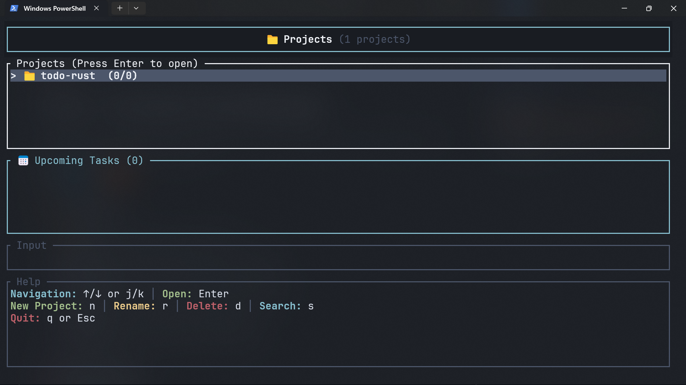

# Todo - Terminal Task Manager

A fast and beautiful terminal-based todo app built with Rust. Manage your tasks with ease using keyboard shortcuts and a clean interface.




## ✨ Features

- **📁 Projects** - Organize tasks into projects
- **📝 Tasks** - Add title, description, status, and priority
- **📅 Due Dates** - Set deadlines with a visual calendar
- **⏰ Reminders** - See upcoming tasks on the homepage
- **🔍 Search** - Find tasks instantly with fuzzy search
- **🎨 Priorities** - Eisenhower Matrix (4 quadrants)
- **💾 Auto-Save** - Everything saves automatically

## 🚀 Quick Start

### Install Rust (if needed)

Download from [rust-lang.org](https://www.rust-lang.org/)

### Build & Run

```bash
git clone <repository-url>
cd rust
cargo build --release
./target/release/todo        # Linux/Mac
.\target\release\todo.exe    # Windows
```

## 🎮 How to Use

### Main Screen (Projects)

```
Press 'Enter' to open a project
Press 'n' to create new project
Press 's' to search all tasks
Press 'q' to quit
```

### Inside a Project (Tasks)

```
Press 'a' to add a task
Press 'e' to edit a task
Press 'd' to delete a task
Press 'Enter' to view task details
Press 'Space' to change status (Todo → In Progress → Done)
Press 'p' to change priority (Q1 → Q2 → Q3 → Q4)
Press 't' to set due date
Press 's' to search
Press 'Backspace' to go back
```

### Understanding Task Display

Tasks look like this:

```
[ ] 🟢 Q2 Buy groceries                              Tomorrow 14:30
[>] 🔴 Q1 Finish report                              Today 10:00
[X] 🟡 Q3 Call John                                  2024-12-20 09:30
```

**Status Symbols:**

- `[ ]` = Todo (Yellow)
- `[>]` = In Progress (Blue)
- `[X]` = Done (Green)

**Priority Badges:**

- 🔴 Q1 = Urgent & Important (Do First)
- 🟢 Q2 = Not Urgent & Important (Plan/Schedule)
- 🟡 Q3 = Urgent & Not Important (Delegate)
- ⚪ Q4 = Not Urgent & Not Important (Eliminate)

**Due Date Colors:**

- **Red** = Overdue
- **Yellow** = Due today
- **Green** = Due soon (tomorrow or this week)
- **Cyan** = Future dates
- **White** = Completed (stops showing urgency)

## 📋 Common Tasks

### Add a Task with Everything

1. Press `a` → Type title → Press Enter
2. Type description → Press Enter
3. Press `t` → Pick date on calendar → Press Enter
4. Type time (like 14:30) → Press Enter
5. Press `p` to set priority
6. Done! 🎉

### Set a Due Date

1. Select a task → Press `t`
2. Use arrow keys to navigate calendar
3. Press `n` for next month, `p` for previous month
4. Press Enter → Type time (14:30) → Press Enter

### Search for a Task

1. Press `s` anywhere
2. Start typing - results appear instantly
3. Press **Tab** or **Enter** to switch to results
4. Use **j/k** or arrow keys to navigate results
5. Press **Tab** to go back to typing
6. Press Enter to view details
7. Press Esc to exit search

**Tip:** Search has two modes:

- **Typing Mode** (Yellow border) - All keys add to search
- **Navigation Mode** (Yellow border on results) - Use j/k to navigate, p/t/d for actions

### View Upcoming Tasks

Just look at the "Upcoming Tasks" panel on the homepage! It shows your next 5 deadlines.

## ⌨️ All Keyboard Shortcuts

### Project View

| Key            | Action         |
| -------------- | -------------- |
| `↑/↓` or `j/k` | Navigate       |
| `Enter`        | Open project   |
| `n`            | New project    |
| `r`            | Rename project |
| `d`            | Delete project |
| `s`            | Search tasks   |
| `q` or `Esc`   | Quit           |

### Task View

| Key             | Action                             |
| --------------- | ---------------------------------- |
| `↑/↓` or `j/k`  | Navigate                           |
| `Enter`         | View details                       |
| `a`             | Add task                           |
| `e`             | Edit task                          |
| `d`             | Delete task                        |
| `Space` or `c`  | Cycle status                       |
| `1` / `2` / `3` | Set status (Todo/In Progress/Done) |
| `p`             | Cycle priority                     |
| `t`             | Set due date                       |
| `x`             | Clear due date                     |
| `s`             | Search                             |
| `Backspace`     | Go back                            |
| `q` or `Esc`    | Quit                               |

### Calendar (When Setting Due Date)

| Key                    | Action         |
| ---------------------- | -------------- |
| `Arrow keys` or `hjkl` | Navigate days  |
| `n`                    | Next month     |
| `p`                    | Previous month |
| `Enter`                | Confirm date   |
| `Esc`                  | Cancel         |

### Search Mode

| Key            | When Typing          | When Navigating       |
| -------------- | -------------------- | --------------------- |
| `Tab`          | Switch to navigation | Switch to typing      |
| `Enter`        | Switch to navigation | View task details     |
| `Esc`          | Clear search / Exit  | Back to typing / Exit |
| `q`            | Add to search        | Quit app              |
| Type letters   | Add to search        | (doesn't work)        |
| `j/k` or `↑/↓` | Add to search        | Navigate results      |
| `Space` or `c` | Add to search        | Change status         |
| `p`            | Add to search        | Change priority       |
| `t`            | Add to search        | Set due date          |
| `d`            | Add to search        | Delete task           |
| `Backspace`    | Delete character     | (doesn't work)        |

**How it works:**

- **Typing Mode** (Yellow search box border) - All keys add to your search query (including 'q')
- **Navigation Mode** (Yellow results border) - Use shortcuts to interact with tasks ('q' quits)
- Press **Tab** to switch between modes anytime

## 💾 Where is My Data?

Your tasks are saved automatically to:

- **Windows**: `%APPDATA%\dev-todo\projects.json`
- **Mac/Linux**: `~/.config/dev-todo/projects.json`

## 🛠️ Advanced Setup

### Add to PATH (Windows)

So you can run `todo` from anywhere:

1. Copy `todo.exe` to `C:\DevTools\`
2. Add `C:\DevTools` to your PATH environment variable
3. Restart your terminal
4. Type `todo` anywhere!

### Add to PATH (Mac/Linux)

```bash
sudo cp target/release/todo /usr/local/bin/
```

## 🎨 Customization

Want different colors? Edit `src/task.rs`:

```rust
Status::Todo => ("[ ]", Color::Yellow),  // Change Yellow
Status::InProgress => ("[>]", Color::Blue),  // Change Blue
Status::Done => ("[X]", Color::Green),  // Change Green
```

## 🐛 Troubleshooting

**App won't start?**

- Delete the data file (you'll lose your tasks):
  - Windows: Delete `%APPDATA%\dev-todo\projects.json`
  - Mac/Linux: Delete `~/.config/dev-todo/projects.json`

**Data not saving?**

- Make sure the app has permission to write to the config folder
- Manually create the folder if needed

## 📦 Dependencies

- **ratatui** - Beautiful terminal UI
- **crossterm** - Cross-platform terminal control
- **chrono** - Date and time handling
- **fuzzy-matcher** - Fast fuzzy search
- **serde/serde_json** - Save/load data

## 🤝 Contributing

Found a bug? Have an idea? Contributions welcome!

- Report issues
- Submit pull requests
- Suggest features

## 📄 License

MIT License - See LICENSE file for details

## 🎯 Tips for Productivity

1. **Start your day** by checking the "Upcoming Tasks" panel
2. **Use priorities** to focus on what matters (Q1 first!)
3. **Search is your friend** - Press `s` when you can't find something
4. **Set due dates** for everything important
5. **Review completed tasks** to see your progress

---

**Made with ❤️ and Rust**

Need help? Press `q` to quit and read this README again! 😊
